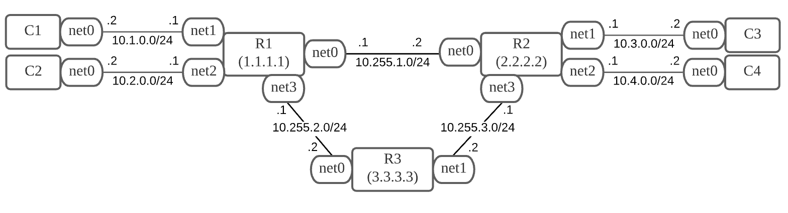
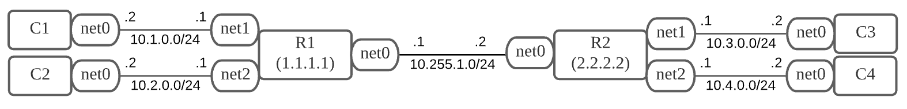

# Z4 講義用
2021_07_26~  
Yokoo Kazuma  

## (1) 復習
演習課題: Virtual Network playground 2  
  
  

>netns_pg2/

## (2) TiNET入門 
### 課題: 基本  
演習課題: Virtual Network playground 1  

  

Usage  

~~~
tinet up -c spec.yaml | sudo sh -x
tinet conf -c spec.yaml | sudo sh -x
tinet test -c spec.yaml | sudo sh -x
tinet down -c spec.yaml | sudo sh -x
~~~

>tinet_pg1/  
>yamlファイルは以下を使用   
>https://github.com/tinynetwork/tinet/blob/master/examples/simple/topo2/spec.yaml  

### 課題: 実践  

